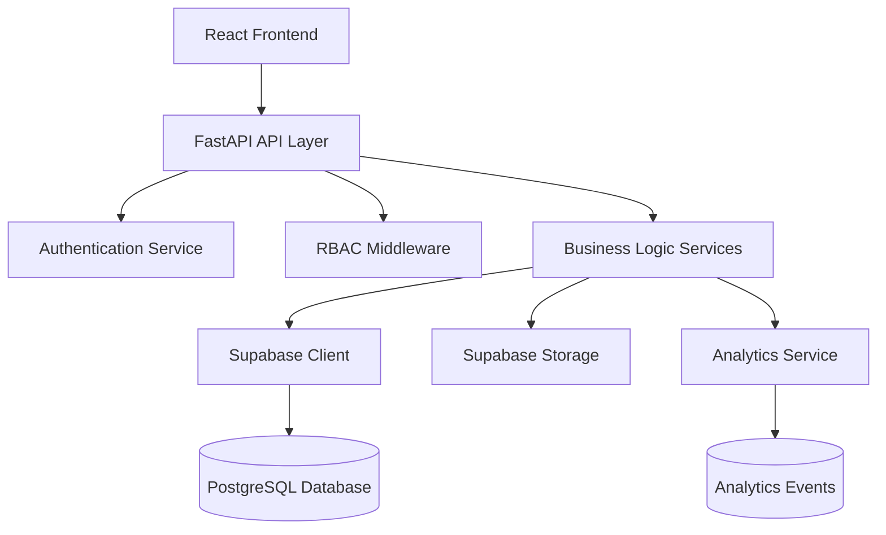
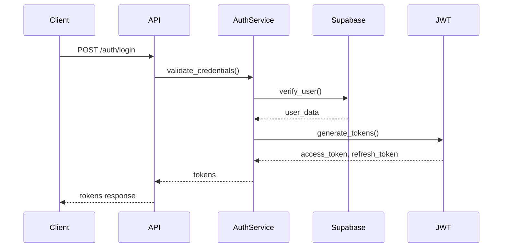
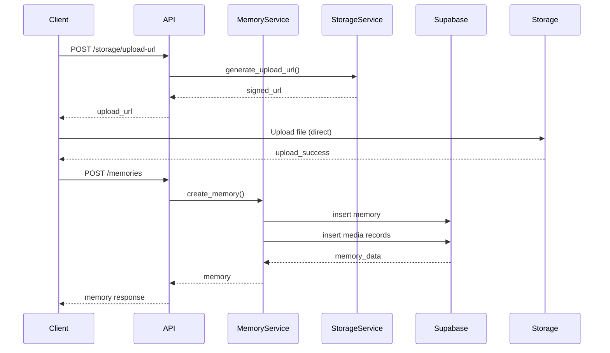
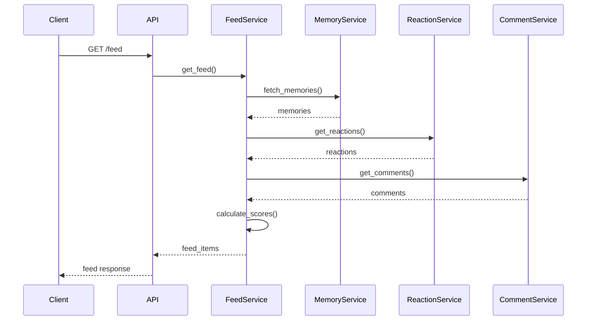

# Architecture Overview

The Timeless Love backend is built with FastAPI and Supabase, following a layered architecture pattern with clear separation of concerns.

## System Architecture



## Component Overview

### API Layer (`app/api/v1/`)

FastAPI route handlers that define HTTP endpoints:

- **auth.py**: Authentication endpoints (register, login, refresh)
- **invites.py**: Invitation management
- **memories.py**: Memory CRUD operations
- **storage.py**: Media upload/access URLs
- **feed.py**: Feed generation and interactions

### Service Layer (`app/services/`)

Business logic and domain operations:

- **auth_service.py**: User authentication and token management
- **memory_service.py**: Memory and media operations
- **feed_service.py**: Feed generation with engagement scoring
- **reaction_service.py**: Reaction management
- **comment_service.py**: Comment threading and management
- **storage_service.py**: Supabase Storage integration
- **analytics_service.py**: Event logging and metrics
- **rbac.py**: Role-based access control utilities

### Data Layer (`app/db/`)

Database clients and connection management:

- **supabase.py**: Supabase client initialization
- **graph_db.py**: LangGraph PostgreSQL integration

### Models (`app/models/`)

Pydantic models representing database entities:

- **user.py**: User profiles and authentication
- **family.py**: Family units
- **memory.py**: Memories and media
- **feed.py**: Feed items and engagement
- **analytics.py**: Events and metrics

### Schemas (`app/schemas/`)

Request/response validation schemas:

- **auth.py**: Authentication requests/responses
- **memory.py**: Memory creation/update schemas
- **feed.py**: Feed filtering and pagination

## Data Flow

### Authentication Flow



### Memory Creation Flow



### Feed Generation Flow



## Technology Stack

### Core Framework

- **FastAPI**: Modern Python web framework with automatic OpenAPI documentation
- **Pydantic**: Data validation and settings management
- **Uvicorn**: ASGI server for running FastAPI

### Database & Storage

- **Supabase**: Backend-as-a-Service providing:
  - PostgreSQL database with Row Level Security
  - Object storage for media files
  - Authentication service
- **PostgreSQL**: Primary database for all structured data

### Authentication & Security

- **python-jose**: JWT token encoding/decoding
- **HS256**: HMAC-SHA256 algorithm for JWT signing
- **Row Level Security (RLS)**: Database-level access control

### Media Processing

- **Pillow**: Image processing and thumbnail generation

### Analytics

- **Custom Analytics Service**: Event logging and metrics collection
- **JSONB**: Flexible metadata storage in PostgreSQL

## Security Architecture

### Multi-Layer Security

1. **Endpoint Level**: FastAPI dependencies enforce RBAC
2. **Service Level**: Business logic validates permissions
3. **Database Level**: RLS policies enforce family boundaries

### Authentication Flow

1. User authenticates with Supabase Auth
2. Backend validates Supabase token
3. Backend issues custom JWT with role and family context
4. All API requests validated via JWT middleware

See [Authentication Guide](./features/authentication.md) for details.

## Database Schema

### Core Tables

- **user_profiles**: User identity and roles
- **family_units**: Family groupings
- **memories**: Memory posts
- **memory_media**: Media file references
- **reactions**: Emoji reactions on memories
- **comments**: Threaded comments
- **invitations**: Family invitation tokens
- **analytics_events**: Event logging
- **analytics_metrics**: Performance metrics

See [Database Schema Documentation](../database/) for detailed schemas.

## API Versioning

All endpoints are versioned under `/api/v1/`:

- Version configured via `API_VERSION` environment variable
- Breaking changes require version increment
- Multiple versions can coexist during migration

## Error Handling

### Standard Error Responses

```json
{
  "detail": "Error message describing what went wrong"
}
```

### HTTP Status Codes

- `200 OK`: Successful request
- `201 Created`: Resource created
- `400 Bad Request`: Invalid input
- `401 Unauthorized`: Authentication required
- `403 Forbidden`: Insufficient permissions
- `404 Not Found`: Resource not found
- `500 Internal Server Error`: Server error

## Performance Considerations

### Caching Strategy

- Access URLs cached client-side until expiration
- Feed scores calculated on-demand (consider caching for large families)

### Database Optimization

- Indexes on frequently queried fields
- Composite indexes for common query patterns
- GIN indexes for JSONB metadata fields

### Background Processing

- Media processing (thumbnails) handled asynchronously
- Analytics events logged in background tasks
- Non-blocking request handling

## Monitoring & Observability

### Structured Logging

- Request ID tracking
- User context in logs
- Error categorization

### Analytics

- Event emission for user actions
- Performance metrics collection
- Feed engagement tracking

See [Analytics Guide](./features/analytics.md) for details.

## Related Documentation

- [Getting Started](../getting-started.md)
- [Authentication](./features/authentication.md)
- [API Reference](../api/)
- [Database Schemas](../database/)

