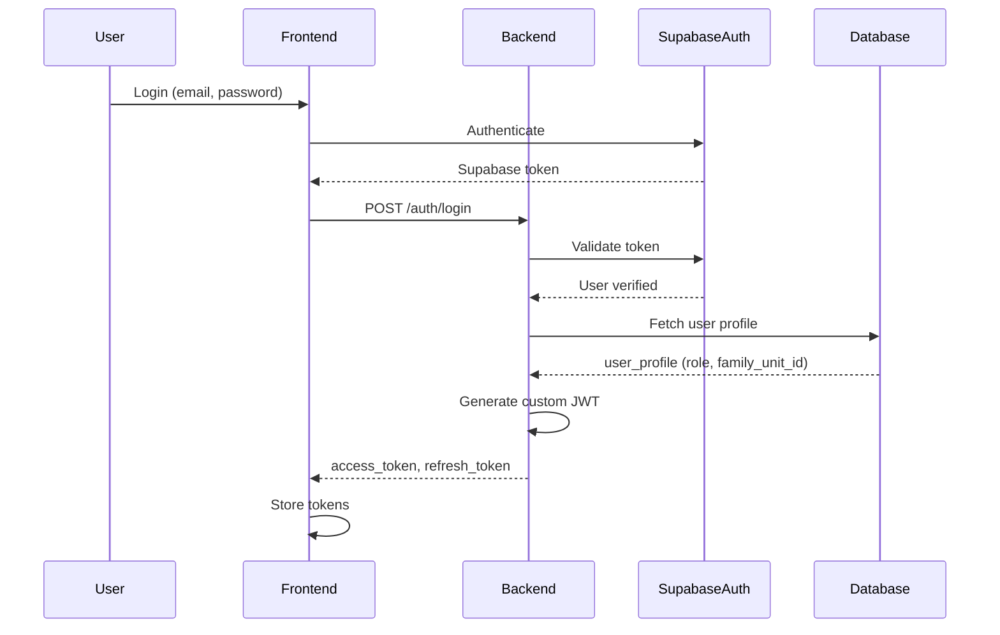
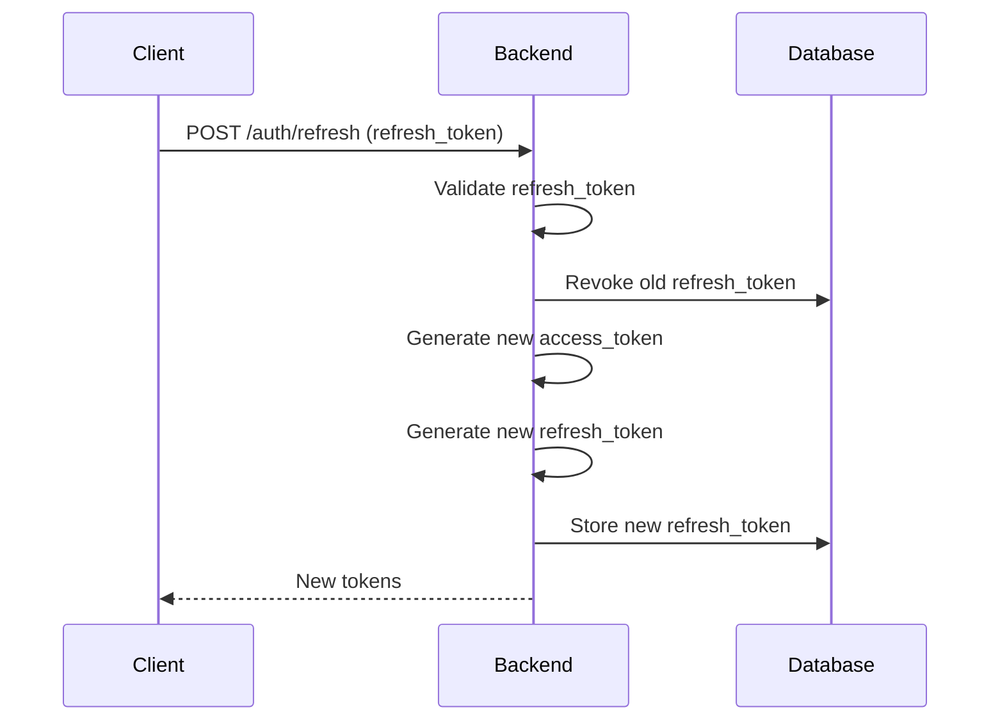

# Authentication

The Timeless Love backend uses a custom JWT authentication scheme that integrates with Supabase Auth while providing role-based access control (RBAC) for family units.

## Overview

Authentication in Timeless Love follows a two-step process:

1. **Supabase Auth**: Users authenticate with email/password via Supabase Auth
2. **Custom JWT**: Backend validates Supabase token and issues custom JWT with role and family context

This approach provides:
- Secure authentication via Supabase
- Custom authorization with role and family context
- Token refresh with rotation
- Family-scoped access control

## Authentication Flow



## JWT Token Structure

### Access Token Claims

```json
{
  "sub": "550e8400-e29b-41d4-a716-446655440000",
  "role": "adult",
  "family_unit_id": "660e8400-e29b-41d4-a716-446655440001",
  "iat": 1704067200,
  "exp": 1704068100,
  "jti": "token-uuid-here",
  "type": "access"
}
```

**Claim Descriptions:**

- `sub`: User UUID (from `user_profiles.id`)
- `role`: User role (`adult`, `teen`, `child`, `grandparent`, `pet`)
- `family_unit_id`: User's family unit UUID
- `iat`: Issued at timestamp
- `exp`: Expiration timestamp
- `jti`: Unique token identifier
- `type`: Token type (`access` or `refresh`)

### Token Lifetimes

- **Access Token**: 15 minutes (900 seconds)
- **Refresh Token**: 7 days (604,800 seconds)

## Registration

### Register Adult User

```python
# POST /api/v1/auth/register/adult
{
  "email": "parent@example.com",
  "password": "SecurePass123!",
  "display_name": "Parent User",
  "family_name": "The Example Family"
}
```

**Response:**
```json
{
  "user_id": "550e8400-e29b-41d4-a716-446655440000",
  "email": "parent@example.com",
  "role": "adult",
  "family_unit_id": "660e8400-e29b-41d4-a716-446655440001",
  "tokens": {
    "access_token": "eyJhbGciOiJIUzI1NiIsInR5cCI6IkpXVCJ9...",
    "refresh_token": "eyJhbGciOiJIUzI1NiIsInR5cCI6IkpXVCJ9...",
    "token_type": "bearer",
    "expires_in": 900
  }
}
```

### Register Other Roles

Similar endpoints exist for:
- `/api/v1/auth/register/teen`
- `/api/v1/auth/register/grandparent`
- `/api/v1/auth/register/child` (requires invitation token)

## Login

### Login Request

```python
# POST /api/v1/auth/login
{
  "email": "parent@example.com",
  "password": "SecurePass123!"
}
```

### Login Response

```json
{
  "access_token": "eyJhbGciOiJIUzI1NiIsInR5cCI6IkpXVCJ9...",
  "refresh_token": "eyJhbGciOiJIUzI1NiIsInR5cCI6IkpXVCJ9...",
  "token_type": "bearer",
  "expires_in": 900
}
```

## Token Refresh

### Refresh Flow



### Refresh Request

```python
# POST /api/v1/auth/refresh
{
  "refresh_token": "eyJhbGciOiJIUzI1NiIsInR5cCI6IkpXVCJ9..."
}
```

**Security**: Refresh tokens are rotated on each refresh (old token is revoked).

## Using Tokens

### Making Authenticated Requests

```bash
curl -X GET http://localhost:8000/api/v1/memories \
  -H "Authorization: Bearer <access_token>"
```

### Python Example

```python
import httpx

headers = {
    "Authorization": f"Bearer {access_token}",
    "Content-Type": "application/json"
}

response = httpx.get(
    "http://localhost:8000/api/v1/memories",
    headers=headers
)
```

## Role-Based Access Control

### Roles

- **adult**: Full permissions, family management
- **teen**: Social interactions, limited management
- **child**: View and create with restrictions
- **grandparent**: Similar to adult, accessibility-focused
- **pet**: Read-only, no active interactions

### Permission Checking

RBAC is enforced at multiple levels:

1. **Endpoint Level**: FastAPI dependencies
```python
from app.dependencies.rbac import require_adult

@router.post("/invites")
async def create_invite(
    current_user: CurrentUser = Depends(require_adult)
):
    # Only adults can access
    ...
```

2. **Service Level**: Business logic validation
```python
from app.services.rbac import can_delete_content

if not can_delete_content(user.role, is_owner):
    raise HTTPException(status_code=403, detail="Permission denied")
```

3. **Database Level**: Row Level Security (RLS) policies

See [RBAC Policy](../security/RBAC_POLICY.md) for detailed permissions.

## Security Best Practices

### Token Storage

**Do:**
- Store access tokens in memory (React state)
- Store refresh tokens securely (httpOnly cookies in production)
- Implement automatic token refresh

**Don't:**
- Store tokens in localStorage (XSS vulnerability)
- Log tokens in console or logs
- Send tokens in URL parameters

### Token Validation

The backend validates tokens on every request:

1. Extract token from `Authorization` header
2. Verify JWT signature
3. Check expiration
4. Validate claims (role, family_unit_id)
5. Check token revocation status

### Token Revocation

Tokens can be revoked for:
- User logout
- Password change
- Suspicious activity
- Account suspension

## Error Responses

### Invalid Token (401)

```json
{
  "detail": "Invalid or expired token"
}
```

### Insufficient Permissions (403)

```json
{
  "detail": "Operation requires adult role"
}
```

### Missing Token (401)

```json
{
  "detail": "Authorization token required"
}
```

## Implementation Details

### JWT Configuration

```python
# app/config.py
JWT_SECRET_KEY: str  # Minimum 32 bytes
JWT_ALGORITHM: str = "HS256"
JWT_ACCESS_TOKEN_EXPIRE_MINUTES: int = 15
JWT_REFRESH_TOKEN_EXPIRE_DAYS: int = 7
```

### Token Generation

```python
from app.utils.jwt import create_access_token, create_refresh_token

access_token = create_access_token(
    user_id=user.id,
    role=user.role,
    family_unit_id=user.family_unit_id
)

refresh_token = create_refresh_token(
    user_id=user.id,
    role=user.role,
    family_unit_id=user.family_unit_id
)
```

### Token Validation

```python
from app.dependencies import get_current_user

@router.get("/memories")
async def list_memories(
    current_user: CurrentUser = Depends(get_current_user)
):
    # current_user contains: user_id, role, family_unit_id
    ...
```

## Related Documentation

- [JWT Scheme Details](../auth/JWT_SCHEME.md)
- [Role Permissions](../auth/ROLE_PERMISSIONS.md)
- [RBAC Policy](../security/RBAC_POLICY.md)
- [API Reference](../api/AUTH_API.md)

