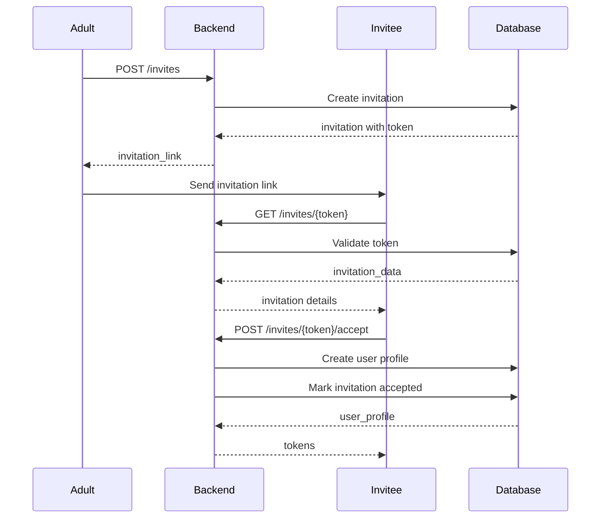

# Family Management

Family management is the foundation of Timeless Love's social structure. All users belong to a family unit, which provides isolation and access control for memories, interactions, and content.

## Concepts

### Family Unit

A **family unit** is a group of users who share memories and content. Each family unit has:

- Unique UUID identifier
- Optional family name
- Creator (first user who registered)
- Members with different roles
- Isolated content (memories, reactions, comments)

### Family Boundaries

All resources are scoped to family units:

- Users can only access content within their family
- Cross-family access is strictly prohibited
- Family unit ID is validated on every request
- Database RLS policies enforce boundaries

## Family Unit Creation

### Automatic Creation

When the first user registers (adult, teen, or grandparent), a family unit is automatically created:

```python
# POST /api/v1/auth/register/adult
{
  "email": "parent@example.com",
  "password": "SecurePass123!",
  "display_name": "Parent User",
  "family_name": "The Example Family"  # Optional
}
```

**Response includes:**
```json
{
  "family_unit_id": "660e8400-e29b-41d4-a716-446655440001",
  ...
}
```

### Manual Creation

Family units can also be created explicitly (though typically automatic):

```python
from app.services.family_service import create_family_unit

family = await create_family_unit(
    created_by=user_id,
    name="The Example Family"
)
```

## Invitation System

### Creating Invitations

Only adults and grandparents can create invitations:

```python
# POST /api/v1/invites
{
  "email": "teen@example.com",
  "role": "teen"
}
```

**Response:**
```json
{
  "id": "990e8400-e29b-41d4-a716-446655440000",
  "email": "teen@example.com",
  "role": "teen",
  "token": "abc123xyz789...",
  "invite_link": "http://localhost:5173/accept-invite?token=abc123xyz789...",
  "expires_at": "2024-01-15T12:00:00Z",
  "status": "pending",
  "created_at": "2024-01-08T12:00:00Z"
}
```

### Invitation Flow



### Invitation Token

- **Format**: URL-safe base64 encoded (32 bytes)
- **Expiration**: 7 days (configurable)
- **Status**: `pending`, `accepted`, `expired`, `revoked`
- **Single-use**: Once accepted, cannot be reused

### Validating Invitations

```python
# GET /api/v1/invites/{token}
```

**Response:**
```json
{
  "valid": true,
  "invite": {
    "id": "990e8400-e29b-41d4-a716-446655440000",
    "email": "teen@example.com",
    "role": "teen",
    "expires_at": "2024-01-15T12:00:00Z",
    "status": "pending"
  }
}
```

### Accepting Invitations

```python
# POST /api/v1/invites/{token}/accept
{
  "email": "teen@example.com",
  "password": "SecurePass123!",
  "display_name": "Teen User"
}
```

**Requirements:**
- Email must match invitation email
- Token must be valid and not expired
- Token must be in `pending` status

## User Provisioning

### Child Account Provisioning

Adults can provision child accounts with auto-generated credentials:

```python
# POST /api/v1/auth/provision/child
{
  "display_name": "Little Doe",
  "email": "child@example.com"  # Optional
}
```

**Response:**
```json
{
  "user_id": "770e8400-e29b-41d4-a716-446655440000",
  "username": "child_abc123",
  "password": "Xy9$kL2mN4pQ6rS",
  "display_name": "Little Doe",
  "family_unit_id": "660e8400-e29b-41d4-a716-446655440001",
  "message": "Credentials provided. Store securely. Password cannot be retrieved."
}
```

**Important:**
- Password is auto-generated and shown only once
- Store credentials securely
- Password cannot be retrieved later
- Child can change password after first login

### Pet Profile Creation

Adults and grandparents can create pet profiles:

```python
# POST /api/v1/auth/register/pet
{
  "display_name": "Fluffy",
  "avatar_url": "https://example.com/pet-avatar.jpg"
}
```

**Response:**
```json
{
  "pet_id": "880e8400-e29b-41d4-a716-446655440000",
  "display_name": "Fluffy",
  "family_unit_id": "660e8400-e29b-41d4-a716-446655440001",
  "message": "Pet profile created. Email notification simulated."
}
```

**Note:** Pet profiles are read-only and don't require authentication.

## Role Assignment

### Roles in Family

- **adult**: Full permissions, family management
- **teen**: Social interactions, limited management
- **child**: View and create with restrictions
- **grandparent**: Similar to adult, accessibility-focused
- **pet**: Read-only, no active interactions

### Role Assignment Rules

1. **During Registration**: Role set based on registration endpoint
2. **Via Invitation**: Role specified in invitation
3. **Child Provisioning**: Always `child` role
4. **Pet Creation**: Always `pet` role
5. **Role Changes**: Currently immutable (future: admin-only changes)

## Family Member Management

### Viewing Family Members

```python
# Query user_profiles for family_unit_id
from app.services.user_service import get_family_members

members = await get_family_members(family_unit_id)
```

### Family Member List

```json
[
  {
    "id": "550e8400-e29b-41d4-a716-446655440000",
    "display_name": "Parent User",
    "role": "adult",
    "email": "parent@example.com",
    "avatar_url": null
  },
  {
    "id": "770e8400-e29b-41d4-a716-446655440001",
    "display_name": "Teen User",
    "role": "teen",
    "email": "teen@example.com",
    "avatar_url": null
  }
]
```

## Family Boundaries Enforcement

### Database Level (RLS)

Row Level Security policies enforce family boundaries:

```sql
CREATE POLICY "Users can view memories in their family"
  ON memories FOR SELECT
  USING (
    family_unit_id IN (
      SELECT family_unit_id 
      FROM user_profiles 
      WHERE id = auth.uid()
    )
  );
```

### Service Level

All service methods validate family unit:

```python
async def get_memory(memory_id: UUID, family_unit_id: UUID):
    # Validate memory belongs to family
    memory = await get_memory_by_id(memory_id)
    if memory.family_unit_id != family_unit_id:
        raise HTTPException(status_code=403, detail="Access denied")
    return memory
```

### API Level

FastAPI dependencies enforce family context:

```python
@router.get("/memories/{memory_id}")
async def get_memory(
    memory_id: UUID,
    current_user: CurrentUser = Depends(get_current_user)
):
    # current_user.family_unit_id is validated
    ...
```

## Best Practices

### Invitation Management

1. **Expiration**: Set appropriate expiration (default: 7 days)
2. **Revocation**: Allow adults to revoke pending invitations
3. **Notifications**: Send email notifications for invitations (future)
4. **Tracking**: Log invitation creation and acceptance

### Child Account Security

1. **Secure Storage**: Store auto-generated passwords securely
2. **Password Reset**: Implement password reset flow for children
3. **Parental Controls**: Allow adults to manage child accounts
4. **Activity Monitoring**: Track child account activity

### Family Unit Management

1. **Naming**: Use descriptive family names
2. **Member Limits**: Consider implementing member limits (future)
3. **Family Settings**: Allow family-level preferences (future)
4. **Data Isolation**: Always validate family_unit_id in queries

## Related Documentation

- [Authentication](./authentication.md)
- [Role Permissions](../auth/ROLE_PERMISSIONS.md)
- [RBAC Policy](../security/RBAC_POLICY.md)
- [API Reference](../api/AUTH_API.md)

