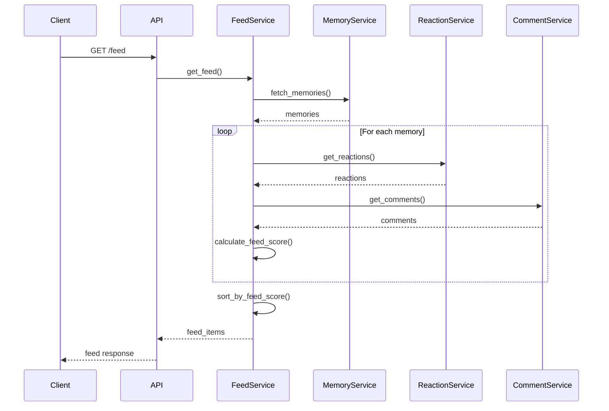

# Feed System

The feed system provides a personalized, engagement-based view of family memories with reactions and threaded comments.

## Concepts

### Feed

The **feed** is a paginated list of memories ordered by engagement score, which combines:

- **Time Score**: Recency of the memory
- **Engagement Score**: Reactions and comments activity

### Feed Score

Each memory receives a **feed score** that determines its position:

```
feed_score = (time_score × 0.6) + (engagement_score × 0.4)
```

### Engagement Metrics

- **Reactions**: Emoji reactions on memories
- **Comments**: Threaded comments with replies
- **User Context**: Which reactions/comments belong to current user

## Feed Algorithm

### Time Score Calculation

Time score uses exponential decay based on hours since creation:

- **Last 24 hours**: 100% weight
- **1-7 days**: 70% weight
- **7-30 days**: 40% weight
- **30+ days**: 20% weight

```python
def calculate_time_score(created_at: datetime) -> float:
    hours_old = (datetime.utcnow() - created_at).total_seconds() / 3600
    
    if hours_old <= 24:
        return 1.0
    elif hours_old <= 168:  # 7 days
        return 0.7
    elif hours_old <= 720:  # 30 days
        return 0.4
    else:
        return 0.2
```

### Engagement Score Calculation

Engagement score combines reactions and comments with weighted normalization:

```python
def calculate_engagement_score(reactions: int, comments: int) -> float:
    # Weighted sum
    weighted_sum = (reactions * REACTION_WEIGHT) + (comments * COMMENT_WEIGHT)
    
    # Normalize using log scale
    if weighted_sum == 0:
        return 0.0
    
    # Log normalization prevents very popular items from dominating
    normalized = math.log(1 + weighted_sum) / math.log(10)
    
    # Scale to 0-1 range
    return min(normalized / 2.0, 1.0)
```

**Weights:**
- Reactions: 1.0x
- Comments: 2.0x (comments are more valuable)

### Final Score

```python
feed_score = (time_score * 0.6) + (engagement_score * 0.4)
```

This gives 60% weight to recency and 40% to engagement.

## Getting the Feed

### Basic Feed Request

```python
# GET /api/v1/feed
```

**Response:**
```json
{
  "items": [
    {
      "id": "550e8400-e29b-41d4-a716-446655440000",
      "title": "Family Vacation 2024",
      "description": "Amazing trip to the beach",
      "memory_date": "2024-07-15",
      "reaction_count": 5,
      "comment_count": 3,
      "reactions_by_emoji": {
        "👍": 3,
        "❤️": 2
      },
      "user_reactions": ["👍"],
      "top_comments": [...],
      "feed_score": 0.85
    }
  ],
  "pagination": {
    "page": 1,
    "page_size": 20,
    "total_pages": 5,
    "has_more": true
  },
  "total_count": 95
}
```

### Feed Filtering

```python
# GET /api/v1/feed?status=published&tags=vacation,beach&user_id={user_id}
```

**Query Parameters:**

| Parameter | Type | Description |
|-----------|------|-------------|
| `status` | string | Filter by status: `draft`, `published`, `archived` |
| `user_id` | UUID | Filter by memory creator |
| `tags` | string | Comma-separated tags |
| `memory_date_from` | ISO date | Filter from date |
| `memory_date_to` | ISO date | Filter to date |
| `search_query` | string | Search in title/description |
| `order_by` | string | Sort by: `feed_score`, `created_at`, `memory_date` |
| `order_direction` | string | `asc` or `desc` |
| `page` | integer | Page number (1-indexed) |
| `page_size` | integer | Items per page (1-100) |

## Reactions System

### Supported Emojis

- `👍` (thumbs_up)
- `❤️` (heart)
- `😂` (laughing)
- `😮` (surprised)
- `😢` (sad)
- `🎉` (celebration)
- `🔥` (fire)
- `💯` (hundred)

### Create Reaction

```python
# POST /api/v1/feed/memories/{memory_id}/reactions
{
  "emoji": "👍"
}
```

**Response:**
```json
{
  "id": "550e8400-e29b-41d4-a716-446655440005",
  "memory_id": "550e8400-e29b-41d4-a716-446655440000",
  "user_id": "550e8400-e29b-41d4-a716-446655440001",
  "emoji": "👍",
  "created_at": "2024-07-15T12:00:00Z",
  "updated_at": "2024-07-15T12:00:00Z"
}
```

**Rules:**
- Each user can have one reaction per emoji type per memory
- Users can change their reaction by deleting and creating a new one
- Pets cannot create reactions

### Delete Reaction

```python
# DELETE /api/v1/feed/memories/{memory_id}/reactions/{reaction_id}
```

### Get Reactions

```python
# GET /api/v1/feed/memories/{memory_id}/reactions
```

**Response:**
```json
[
  {
    "id": "550e8400-e29b-41d4-a716-446655440005",
    "memory_id": "550e8400-e29b-41d4-a716-446655440000",
    "user_id": "550e8400-e29b-41d4-a716-446655440001",
    "emoji": "👍",
    "created_at": "2024-07-15T12:00:00Z"
  }
]
```

## Comments System

### Threaded Comments

Comments support threading with a maximum depth of 3 levels:

```
Top-level comment
  └─ Reply (level 1)
      └─ Reply to reply (level 2)
          └─ Reply to reply (level 3)  # Maximum depth
```

### Create Comment

```python
# POST /api/v1/feed/memories/{memory_id}/comments
{
  "content": "This is a great memory!",
  "parent_comment_id": null  # Top-level comment
}
```

**Response:**
```json
{
  "id": "550e8400-e29b-41d4-a716-446655440007",
  "memory_id": "550e8400-e29b-41d4-a716-446655440000",
  "user_id": "550e8400-e29b-41d4-a716-446655440001",
  "parent_comment_id": null,
  "content": "This is a great memory!",
  "created_at": "2024-07-15T13:00:00Z",
  "updated_at": "2024-07-15T13:00:00Z",
  "deleted_at": null,
  "reply_count": 0,
  "replies": []
}
```

### Create Reply

```python
# POST /api/v1/feed/memories/{memory_id}/comments
{
  "content": "I agree!",
  "parent_comment_id": "550e8400-e29b-41d4-a716-446655440007"
}
```

### Get Comments

```python
# GET /api/v1/feed/memories/{memory_id}/comments?include_replies=true&limit=50
```

**Response includes nested replies:**
```json
[
  {
    "id": "550e8400-e29b-41d4-a716-446655440007",
    "content": "This is a great memory!",
    "reply_count": 2,
    "replies": [
      {
        "id": "550e8400-e29b-41d4-a716-446655440008",
        "content": "I agree!",
        "parent_comment_id": "550e8400-e29b-41d4-a716-446655440007",
        "reply_count": 0,
        "replies": []
      }
    ]
  }
]
```

### Update Comment

```python
# PUT /api/v1/feed/memories/{memory_id}/comments/{comment_id}
{
  "content": "Updated comment content"
}
```

**Permissions:**
- Users can only update their own comments

### Delete Comment

```python
# DELETE /api/v1/feed/memories/{memory_id}/comments/{comment_id}
```

**Soft Delete:**
- Comments are soft-deleted (marked with `deleted_at`)
- Preserves thread structure
- Deleted comments show as "[deleted]"

**Permissions:**
- Users can delete their own comments
- Adults can delete any comment in their family

## Feed Generation Flow



## Best Practices

### Feed Performance

1. **Pagination**: Always use pagination for large families
2. **Caching**: Cache feed scores for frequently accessed memories
3. **Indexing**: Ensure database indexes on `created_at`, `status`, `family_unit_id`
4. **Background Updates**: Update feed scores asynchronously

### Engagement Optimization

1. **Real-time Updates**: Update feed scores when reactions/comments are added
2. **User Context**: Include user's own reactions in feed response
3. **Top Comments**: Show top comments in feed (limit to 2-3)
4. **Reaction Aggregation**: Group reactions by emoji for display

### Comment Threading

1. **Depth Limits**: Enforce maximum nesting depth (3 levels)
2. **Soft Deletes**: Use soft deletes to preserve thread structure
3. **Reply Counts**: Maintain reply counts for performance
4. **Lazy Loading**: Load replies on demand for deep threads

## Related Documentation

- [Memories](./memories.md)
- [API Reference](../api/FEED_API.md)
- [Database Schema](../database/FEED_SCHEMA.md)

