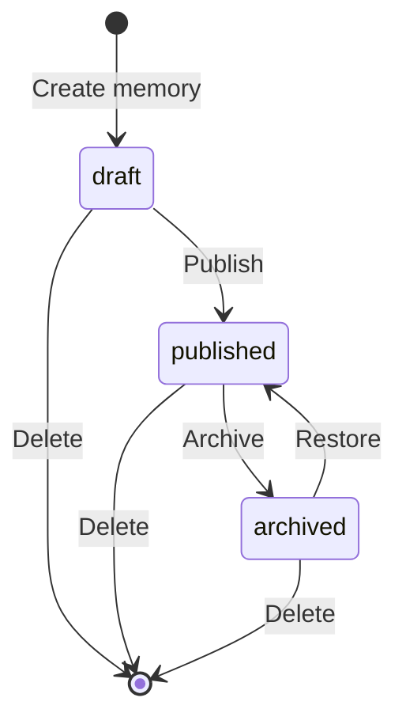
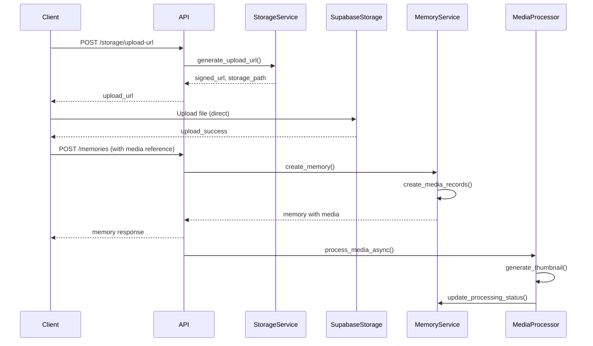

# Memories

Memories are the core content type in Timeless Love. They represent family moments with associated media files (photos and videos) that can be shared within a family unit.

## Concepts

### Memory

A **memory** is a post that contains:

- **Metadata**: Title, description, date, location, tags
- **Status**: `draft`, `published`, or `archived`
- **Media**: Associated photos and videos
- **Ownership**: Created by a user within a family unit
- **Audit**: Created/updated timestamps and modified_by tracking

### Memory Status

- **draft**: Not visible to family, can be edited
- **published**: Visible to all family members
- **archived**: Hidden from feed but preserved

### Media

Each memory can have multiple media files:

- **Images**: JPEG, PNG, GIF, WebP
- **Videos**: MP4, WebM
- **Processing**: Thumbnails generated automatically
- **Metadata**: Dimensions, duration, file size

## Memory Lifecycle



## Creating Memories

### Basic Memory Creation

```python
# POST /api/v1/memories
{
  "title": "Family Vacation",
  "description": "Our trip to the beach",
  "memory_date": "2024-01-15",
  "location": "Beach Resort",
  "tags": ["vacation", "beach", "family"],
  "status": "published"
}
```

**Response:**
```json
{
  "id": "770e8400-e29b-41d4-a716-446655440002",
  "user_id": "550e8400-e29b-41d4-a716-446655440000",
  "family_unit_id": "660e8400-e29b-41d4-a716-446655440001",
  "title": "Family Vacation",
  "description": "Our trip to the beach",
  "memory_date": "2024-01-15",
  "location": "Beach Resort",
  "tags": ["vacation", "beach", "family"],
  "status": "published",
  "created_at": "2024-01-20T12:00:00Z",
  "updated_at": "2024-01-20T12:00:00Z",
  "media": []
}
```

### Memory with Media

```python
# POST /api/v1/memories
{
  "title": "Family Vacation",
  "status": "published",
  "media": [
    {
      "storage_path": "660e8400-e29b-41d4-a716-446655440001/770e8400-e29b-41d4-a716-446655440002/photo.jpg",
      "file_name": "photo.jpg",
      "mime_type": "image/jpeg",
      "file_size": 2048576
    }
  ]
}
```

## Media Upload Flow

### Complete Upload Process



### Step 1: Request Upload URL

```python
# POST /api/v1/storage/upload-url
{
  "memory_id": "770e8400-e29b-41d4-a716-446655440002",
  "file_name": "photo.jpg",
  "mime_type": "image/jpeg"
}
```

**Response:**
```json
{
  "upload_url": "https://...supabase.co/storage/v1/object/sign/memories/...",
  "storage_path": "660e8400-e29b-41d4-a716-446655440001/770e8400-e29b-41d4-a716-446655440002/photo.jpg",
  "expires_in": 300
}
```

### Step 2: Upload File Directly

Upload directly to Supabase Storage using the signed URL:

```javascript
const formData = new FormData();
formData.append('file', file);

const response = await fetch(uploadUrlResponse.upload_url, {
  method: 'POST',
  body: formData
});
```

### Step 3: Register Media

Create memory with media reference:

```python
# POST /api/v1/memories
{
  "title": "New Memory",
  "status": "published",
  "media": [
    {
      "storage_path": "660e8400-e29b-41d4-a716-446655440001/770e8400-e29b-41d4-a716-446655440002/photo.jpg",
      "file_name": "photo.jpg",
      "mime_type": "image/jpeg",
      "file_size": 2048576
    }
  ]
}
```

## Media Processing Pipeline

### Processing Status

Media files are processed asynchronously:

- **pending**: Uploaded, processing not started
- **processing**: Currently being processed
- **completed**: Thumbnail generated, metadata extracted
- **failed**: Processing failed (check metadata.error)

### Thumbnail Generation

For images:
- Thumbnail size: 400x400px (configurable)
- Format: JPEG
- Maintains aspect ratio
- Stored alongside original

For videos:
- First frame extracted as thumbnail
- Duration extracted from metadata

### Metadata Extraction

Extracted metadata includes:
- **Images**: Width, height, format
- **Videos**: Duration, resolution, codec
- **All**: File size, MIME type

## Managing Memories

### Get Memory

```python
# GET /api/v1/memories/{memory_id}
```

**Response includes:**
- Memory metadata
- Associated media with processing status
- User information

### Update Memory

```python
# PUT /api/v1/memories/{memory_id}
{
  "title": "Updated Title",
  "description": "Updated description",
  "tags": ["updated", "tags"],
  "status": "published"
}
```

**Permissions:**
- Owner can update own memories
- Adults can update any memory in family

### Delete Memory

```python
# DELETE /api/v1/memories/{memory_id}
```

**Cascading:**
- Deletes associated media records
- Media files remain in storage (cleanup job handles removal)

### List Memories

```python
# GET /api/v1/memories?limit=20&offset=0&status=published
```

**Query Parameters:**
- `limit`: Number of results (default: 20, max: 100)
- `offset`: Pagination offset (default: 0)
- `status`: Filter by status (`draft`, `published`, `archived`)

## Adding Media to Existing Memory

### Add Media

```python
# POST /api/v1/memories/{memory_id}/media
{
  "storage_path": "660e8400-e29b-41d4-a716-446655440001/770e8400-e29b-41d4-a716-446655440002/photo2.jpg",
  "file_name": "photo2.jpg",
  "mime_type": "image/jpeg",
  "file_size": 1536000
}
```

### Remove Media

```python
# DELETE /api/v1/memories/{memory_id}/media/{media_id}
```

## File Constraints

### Size Limits

- **Per File**: 50MB maximum
- **Per Memory**: 200MB total (sum of all media)

### Allowed File Types

**Images:**
- `image/jpeg` (.jpg, .jpeg)
- `image/png` (.png)
- `image/gif` (.gif)
- `image/webp` (.webp)

**Videos:**
- `video/mp4` (.mp4)
- `video/webm` (.webm)

## Storage Path Structure

Files are stored with the following structure:

```
memories/
  {family_unit_id}/
    {memory_id}/
      {media_id}.{ext}          # Original file
      {media_id}_thumb.jpg      # Thumbnail (generated)
```

**Example:**
```
memories/
  660e8400-e29b-41d4-a716-446655440001/
    770e8400-e29b-41d4-a716-446655440002/
      880e8400-e29b-41d4-a716-446655440003.jpg
      880e8400-e29b-41d4-a716-446655440003_thumb.jpg
```

## Accessing Media

### Get Access URL

```python
# GET /api/v1/storage/access-url?storage_path={path}&expires_in=3600
```

**Response:**
```json
{
  "access_url": "https://...supabase.co/storage/v1/object/sign/memories/...",
  "expires_in": 3600
}
```

### Get Media URL by ID

```python
# GET /api/v1/storage/media/{media_id}/url?expires_in=3600
```

## Best Practices

### Memory Creation

1. **Draft First**: Create as draft, then publish when ready
2. **Batch Uploads**: Request all upload URLs first, then upload in parallel
3. **Progress Tracking**: Show upload progress for large files
4. **Error Recovery**: Handle upload failures gracefully

### Media Management

1. **Thumbnail Usage**: Use thumbnails for gallery views
2. **URL Caching**: Cache access URLs until expiration
3. **Processing Status**: Poll memory endpoint to check processing status
4. **File Validation**: Validate file type and size before upload

### Performance

1. **Lazy Loading**: Load media on demand
2. **Pagination**: Use pagination for memory lists
3. **Caching**: Cache frequently accessed memories
4. **Background Processing**: Don't block on media processing

## Related Documentation

- [Storage Guide](./storage.md)
- [Feed System](./feed.md)
- [API Reference](../api/MEMORIES_API.md)
- [Storage Implementation](../storage/STORAGE_GUIDE.md)

