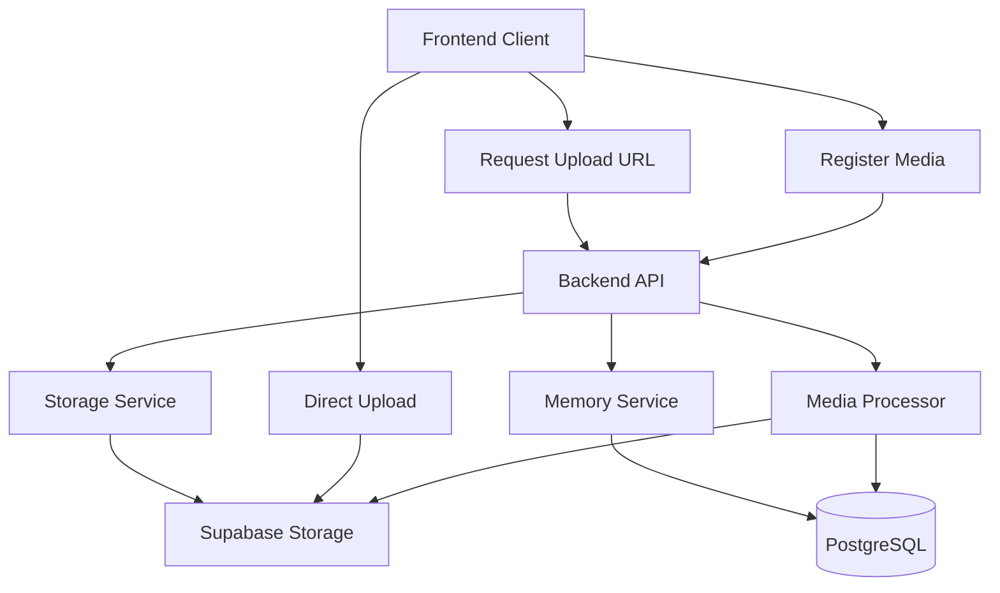

# Storage

The storage system handles media file uploads and access using Supabase Storage with signed URLs for secure, time-limited access.

## Overview

Media files are stored in Supabase Storage with the following characteristics:

- **Direct Upload**: Files uploaded directly to Supabase Storage (bypassing backend)
- **Signed URLs**: Time-limited URLs for upload and access
- **Family Scoping**: Files organized by family unit ID
- **Processing**: Automatic thumbnail generation and metadata extraction

## Storage Architecture



## Storage Bucket

### Configuration

- **Bucket Name**: `memories` (configurable via `STORAGE_BUCKET_NAME`)
- **Access**: Private (not public)
- **File Size Limit**: 50MB per file
- **Total Limit**: 200MB per memory

### Bucket Setup

The bucket must be created in Supabase Dashboard:

1. Go to Storage → Buckets
2. Create bucket named `memories`
3. Set to **Private** (not public)
4. Configure RLS policies (see below)

## Upload Workflow

### Step 1: Request Upload URL

```python
# POST /api/v1/storage/upload-url
{
  "memory_id": "770e8400-e29b-41d4-a716-446655440002",
  "file_name": "photo.jpg",
  "mime_type": "image/jpeg"
}
```

**Response:**
```json
{
  "upload_url": "https://...supabase.co/storage/v1/object/sign/memories/...",
  "storage_path": "660e8400-e29b-41d4-a716-446655440001/770e8400-e29b-41d4-a716-446655440002/photo.jpg",
  "expires_in": 300
}
```

**Details:**
- Upload URL expires in 5 minutes (300 seconds)
- Storage path includes family_unit_id and memory_id
- Path is validated to prevent path traversal

### Step 2: Upload File Directly

Upload directly to Supabase Storage using the signed URL:

```javascript
const formData = new FormData();
formData.append('file', file);

const response = await fetch(uploadUrlResponse.upload_url, {
  method: 'POST',
  body: formData
});
```

**Benefits:**
- Bypasses backend for large files
- Reduces server load
- Faster uploads
- Direct to storage

### Step 3: Register Media

After upload, register the media with the backend:

```python
# POST /api/v1/memories/{memory_id}/media
{
  "storage_path": "660e8400-e29b-41d4-a716-446655440001/770e8400-e29b-41d4-a716-446655440002/photo.jpg",
  "file_name": "photo.jpg",
  "mime_type": "image/jpeg",
  "file_size": 2048576
}
```

## Path Structure

Files are organized by family unit and memory:

```
memories/
  {family_unit_id}/
    {memory_id}/
      {media_id}.{ext}          # Original file
      {media_id}_thumb.jpg      # Thumbnail (generated)
```

**Example:**
```
memories/
  660e8400-e29b-41d4-a716-446655440001/
    770e8400-e29b-41d4-a716-446655440002/
      880e8400-e29b-41d4-a716-446655440003.jpg
      880e8400-e29b-41d4-a716-446655440003_thumb.jpg
```

## Access URLs

### Generate Access URL

```python
# GET /api/v1/storage/access-url?storage_path={path}&expires_in=3600
```

**Response:**
```json
{
  "access_url": "https://...supabase.co/storage/v1/object/sign/memories/...",
  "expires_in": 3600
}
```

**Details:**
- Access URL expires in 1 hour (3600 seconds, configurable)
- Validates that path belongs to user's family
- Returns 403 if access denied

### Get Media URL by ID

```python
# GET /api/v1/storage/media/{media_id}/url?expires_in=3600
```

**Benefits:**
- Uses media ID instead of storage path
- Automatically resolves storage path
- Validates family access

## Security

### Family Scoping

All storage operations validate family unit:

```python
# Storage path must start with user's family_unit_id
storage_path.startswith(f"{family_unit_id}/")
```

### Path Validation

Storage paths are validated to prevent:

- Path traversal attacks (`../`)
- Access to other families' files
- Invalid file names

### Signed URLs

- **Time-limited**: URLs expire after configured time
- **Single-use**: Upload URLs are single-use
- **Secure**: Signed with Supabase service role key

### Row Level Security

Supabase RLS policies enforce access:

```sql
CREATE POLICY "Users can view files in their family"
  ON storage.objects FOR SELECT
  USING (
    bucket_id = 'memories'
    AND (storage.foldername(name))[1] IN (
      SELECT family_unit_id::text
      FROM user_profiles
      WHERE id = auth.uid()
    )
  );
```

## Media Processing

### Processing Pipeline

After media is registered, processing happens asynchronously:

1. **Status**: Set to `processing`
2. **Thumbnail**: Generate thumbnail (images) or extract frame (videos)
3. **Metadata**: Extract dimensions, duration, etc.
4. **Status**: Set to `completed` or `failed`

### Processing Status

- **pending**: Uploaded, processing not started
- **processing**: Currently being processed
- **completed**: Thumbnail generated, ready to use
- **failed**: Processing failed (check metadata.error)

### Thumbnail Generation

**Images:**
- Size: 400x400px (configurable)
- Format: JPEG
- Maintains aspect ratio
- Stored as `{media_id}_thumb.jpg`

**Videos:**
- First frame extracted
- Same thumbnail format as images

## File Constraints

### Size Limits

- **Per File**: 50MB maximum
- **Per Memory**: 200MB total

### Allowed File Types

**Images:**
- `image/jpeg` (.jpg, .jpeg)
- `image/png` (.png)
- `image/gif` (.gif)
- `image/webp` (.webp)

**Videos:**
- `video/mp4` (.mp4)
- `video/webm` (.webm)

## Best Practices

### Upload Optimization

1. **Batch URLs**: Request all upload URLs first, then upload in parallel
2. **Progress Tracking**: Show upload progress for large files
3. **Error Recovery**: Handle upload failures gracefully, allow retry
4. **URL Expiration**: Request new URL if upload takes longer than 5 minutes

### Access Optimization

1. **URL Caching**: Cache access URLs until expiration (1 hour)
2. **Thumbnail Usage**: Use thumbnails for gallery views, full images for detail
3. **Lazy Loading**: Load media on demand
4. **CDN**: Consider CDN for frequently accessed media (future)

### Security

1. **Validate File Types**: Check MIME type before generating upload URL
2. **Validate File Size**: Check size before upload
3. **Path Validation**: Always validate storage paths
4. **Family Scoping**: Never allow cross-family access

## Error Handling

### Upload URL Expiration

If upload takes longer than 5 minutes:
1. Request a new upload URL
2. Retry the upload

### File Size Exceeded

```json
{
  "detail": "File size exceeds maximum allowed size (50MB)"
}
```

### Invalid File Type

```json
{
  "detail": "File type not allowed. Allowed types: image/jpeg, image/png, ..."
}
```

### Access Denied

```json
{
  "detail": "Access denied. File does not belong to your family."
}
```

## Related Documentation

- [Memories](./memories.md)
- [Storage Implementation Guide](../storage/STORAGE_GUIDE.md)
- [API Reference](../api/MEMORIES_API.md)

